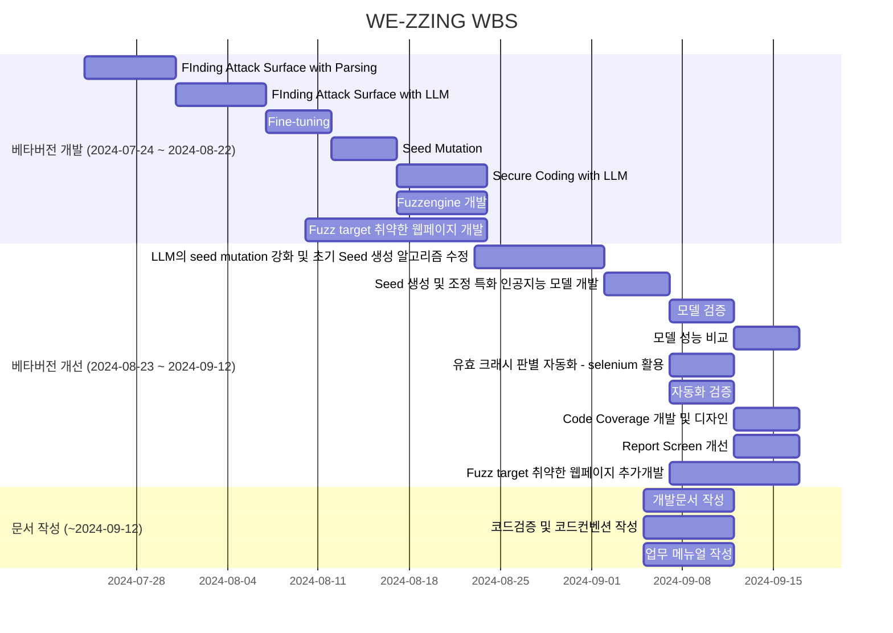

```mermaid
gantt
    title WE-ZZING WBS
    dateFormat  YY-MM-DD
    section 베타버전 개발 (2024-07-24 ~ 2024-08-22)
        FInding Attack Surface with Parsing         :2024-07-24, 7d
        FInding Attack Surface with LLM             :2024-07-31, 7d
        Fine-tuning                                 :2024-08-07, 5d
        Seed Mutation                               :2024-08-12, 5d
        Secure Coding with LLM                      :2024-08-17, 7d
        Fuzzengine 개발                             :2024-08-17, 7d
        Fuzz target 취약한 웹페이지 개발            :2024-08-10, 14d

    section 베타버전 개선 (2024-08-23 ~ 2024-09-12)
        LLM의 seed mutation 강화 및 초기 Seed 생성 알고리즘 수정 :2024-08-23, 10d
        Seed 생성 및 조정 특화 인공지능 모델 개발           :2024-09-02, 5d
        모델 검증                                    :2024-09-07, 5d
        모델 성능 비교                                :2024-09-12, 5d
        유효 크래시 판별 자동화 - selenium 활용        :2024-09-07, 5d
        자동화 검증                                  :2024-09-07, 5d
        Code Coverage 개발 및 디자인                  :2024-09-12, 5d
        Report Screen 개선                           :2024-09-12, 5d
        Fuzz target 취약한 웹페이지 추가개발           :2024-09-07, 10d

    section 문서 작성 (~2024-09-12)
        개발문서 작성                               :2024-09-05, 7d
        코드검증 및 코드컨벤션 작성                   :2024-09-05, 7d
        업무 메뉴얼 작성                             :2024-09-05, 7d
```
