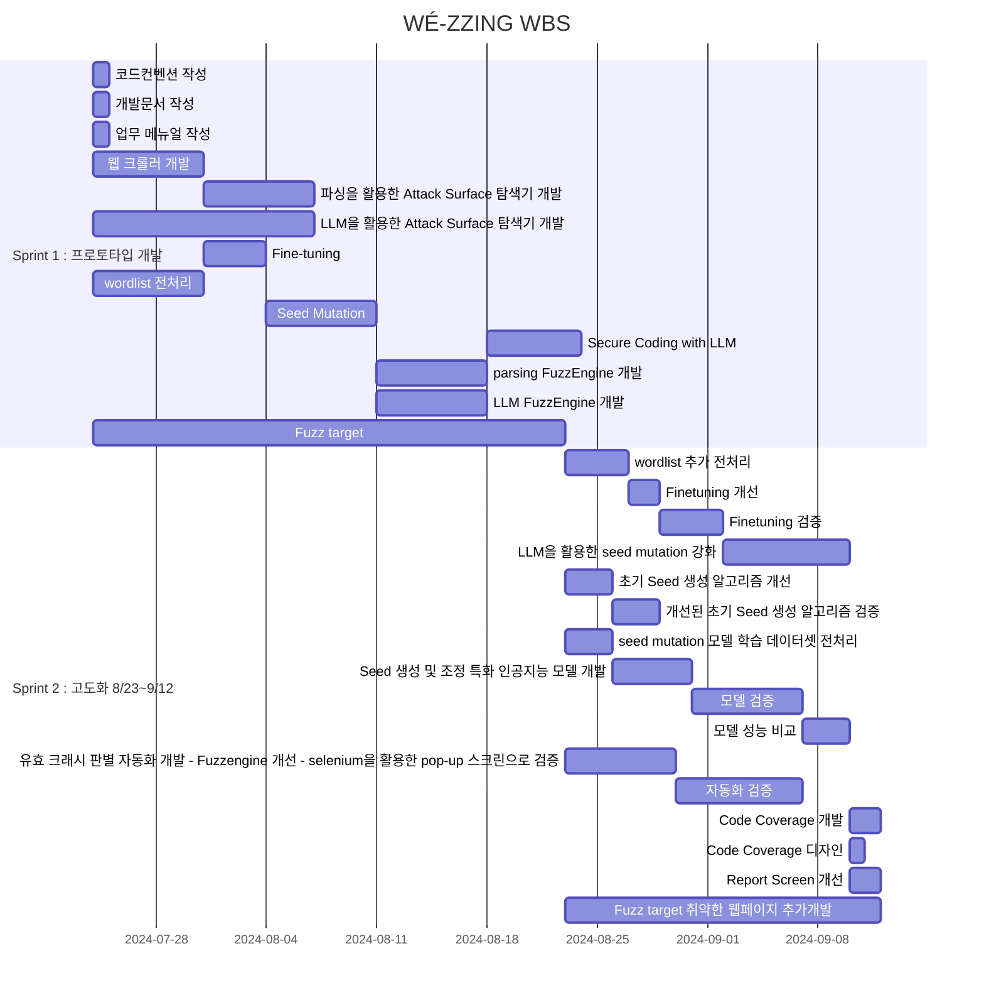

```mermaid
gantt
    title WÉ-ZZING WBS
    dateFormat  YY-MM-DD
    section Sprint 1 : 프로토타입 개발

	코드컨벤션 작성                   : 2024-07-24, 1d
        개발문서 작성                               :2024-07-24, 1d
        업무 메뉴얼 작성                             :2024-07-24, 1d
        웹 크롤러 개발         :2024-07-24, 7d
	파싱을 활용한 Attack Surface 탐색기 개발 : 2024-07-31, 7d
        LLM을 활용한 Attack Surface 탐색기 개발      :2024-07-24, 14d
        Fine-tuning                                 :2024-07-31, 4d
	wordlist 전처리                                :2024-07-24, 7d
        Seed Mutation                               :2024-08-04, 7d
        Secure Coding with LLM                      :2024-08-18, 6d
        parsing FuzzEngine 개발                             :2024-08-11, 7d
	LLM FuzzEngine 개발                          :2024-08-11, 7d
        Fuzz target : 취약한 웹페이지 개발            :2024-07-24, 30d

	
    section Sprint 2 : 고도화 8/23~9/12
       	wordlist 추가 전처리 : 2024-08-23, 4d
	Finetuning 개선	             :2024-08-27, 2d
	Finetuning 검증             :2024-08-29, 4d
 	LLM을 활용한 seed mutation 강화 : 프롬프트 튜닝&엔지니어링          :2024-09-02, 8d
	초기 Seed 생성 알고리즘 개선 :2024-08-23, 3d
	개선된 초기 Seed 생성 알고리즘 검증 :2024-08-26, 3d
	seed mutation 모델 학습 데이터셋 전처리 : 2024-08-23, 3d
        Seed 생성 및 조정 특화 인공지능 모델 개발           :2024-08-26, 5d
        모델 검증                                    :2024-08-31, 7d
        모델 성능 비교                                :2024-09-07, 3d
        유효 크래시 판별 자동화 개발 - Fuzzengine 개선 - selenium을 활용한 pop-up 스크린으로 검증        :2024-08-23, 7d
        자동화 검증                                  :2024-08-30, 8d
        Code Coverage 개발                                 :2024-09-10, 2d
	Code Coverage 디자인                  :2024-09-10, 1d
        Report Screen 개선                           :2024-09-10, 2d
        Fuzz target 취약한 웹페이지 추가개발          : 2024-08-23, 20d

```
